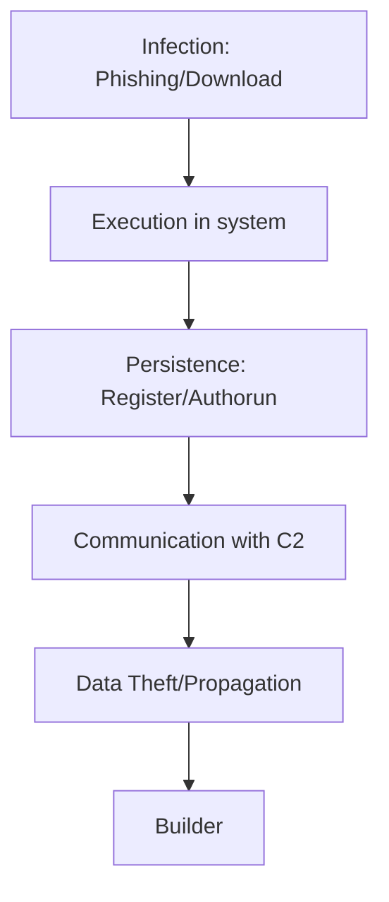

[github-link]: https://github.com/k4itrun/wish

<div align="center">

<br/>

# [@Wish Stealer][github-link]

Node.js malware for Windows that steals data from Discord, browsers, and crypto wallets, affecting all users.

</div>

## Table of Contents

1. [Uninstalling](#uninstalling)
2. [Contributing](#contributing)
3. [Contact](#contact)
4. [License](#license)
5. [Disclaimer](#disclaimer)

> [!IMPORTANT]
> 🪁 It is recommended to analyze all the code to avoid future bugs 
> **and also add your star 🌟 to this repository**.

> [!NOTE]
> 🧪 Something like this stealer works **fast and efficient**.



> [!WARNING]
> ♻ For testing or checking purposes I recommend that you do not run it on my machine, it could be dangerous **if you know what you are doing ignore this message**.

## Uninstalling

1. Open PowerShell as Administrator.

2. Terminate processes:

```bash
taskkill /f /t /im Wish.exe
taskkill /f /t /im WindowsSecurityHealthService.exe
```

3. Remove from startup:

```bash
reg delete "HKCU\Software\Microsoft\Windows\CurrentVersion\Run" /v "Windows Security Health Service" /f
```

## Contributing

We greatly appreciate any contributions to this project! Whether you want to open new issues, submit pull requests, or share suggestions for improvements, your input is invaluable. We encourage you to refer to our [Contributing Guidelines](../../CONTRIBUTING.md) to facilitate a seamless collaboration process.

You can also support the development of this software through a donation, helping me bring new optimal and improved projects to life.

<a href="https://ko-fi.com/A0A11481X5">
  
</a>

Thank you for your interest and support! ☕

## Contact

For any inquiries or support, you can reach out via [billoneta@proto.me](mailto:billoneta@proto.me) or join our [Discord Server](https://discord.gg/A6Vu7gYE).

## License

This software is licensed under the [MIT License](../../LICENSE).

## Disclaimer

### Important Notice: Educational Use Only.

This tool is designed solely for educational purposes. Any misuse of this tool is strictly prohibited. By using this tool, you acknowledge and accept these terms.

### User Accountability:

By utilizing this tool, you take full responsibility for your actions. The creator disclaims any liability for misuse. It is your responsibility to ensure that your use of this software complies with all applicable laws and regulations.

### No Assistance:

The creator will not provide assistance or support for any misuse of this tool. Any inquiries related to harmful or illegal activities will be ignored.

### Terms Acceptance:

By using this tool, you agree to abide by this disclaimer. If you do not agree with these terms, please do not use the software.